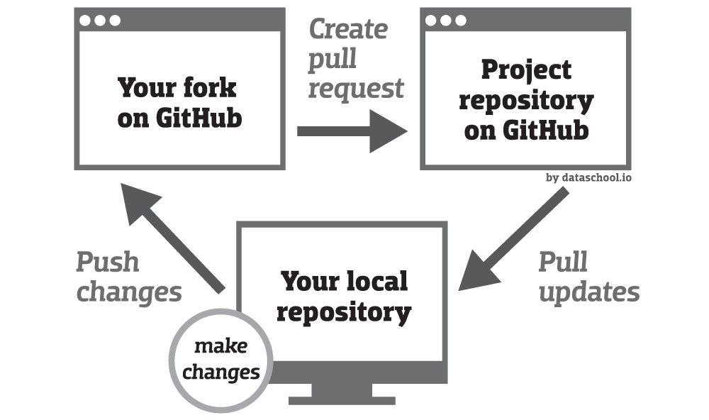

## Getting started

### Main Dependencies
- [FuseSoC](https://fusesoc.readthedocs.io/en/stable/user/installation.html#installation-under-linux)
- [SymbiYosys and Yosys](https://symbiyosys.readthedocs.io/en/latest/)
- [Verilator](https://verilator.org/guide/latest/install.html) 
- [sv2v](https://github.com/saw235/sv2v)

### To start contributing
Easiest way to get started without dealing with all the **dependencies** is to use the docker `.devcontainer` that was prepared.
This will create and prepare a virtual machine image and install all the required dependencies. 
 
1. Install 
    - [Docker](https://docs.docker.com/get-docker/)
    - [VSCode](https://code.visualstudio.com/download)
    - [VSCode Remote Development Extension Pack](https://marketplace.visualstudio.com/items?itemName=ms-vscode-remote.vscode-remote-extensionpack)
2. Create a Github **fork** of this repository. See *Development Flow* below
3. `git clone git@github.com:<your_username>/riscv-core-dev.git` 
4. `cd riscv-core-dev && code .` 
5. When VSCode prompt to "reopen in container" -> **Yes**
6. Alternatively, you can also build/pull the docker image yourself and manage it:
    - **Pull** the image with `docker pull saw235/riscvsv`, or
    - **Build** the image with `docker build --pull --rm -f ".devcontainer/Dockerfile" -t digital_design_devcontainer ".devcontainer"`
 
The docker image is persistent and cached so only the first run will take up installation time.

### Setup
Before running any simulation or rtl related commands, you should run the following to register your RTL 
and pull all other RTL dependencies in FuseSoC (our HDL package manager)
```bash
fusesoc library add riscv-core-dev .
fusesoc library add lowrisc_prim https://github.com/saw235/lowrisc_prim
```

### To run simulation or formal
```
fusesoc run --target=sim riscv-sv
fusesoc run --target=formal riscv-sv
```

### Development Flow



### To contribute to microarchitecture
1. Send an email to <sawxuezheng01@gmail.com> titled "uarch contrb request" and I will share with you the link to the folder which host all the drawio files.
2. The updated microarchitecture in SVG format should be located in the `doc/uarch` folder.
3. Pull/merge request related to the microarchitecture should be tagged with the keyword *UARCH*. For example "UARCH - Bitmanip Extension" or "UARCH - FPU"      
